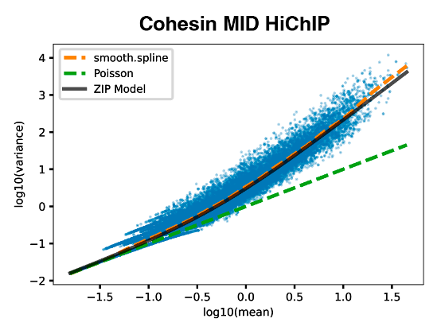

# Overdispersion and Bias Jointly Emulating and Correcting Tool (OBJECT) for HiChIP

## Introduction

HiChIP data contains bias from both Hi-C (distance dependent contact frequencies, ) and ChIP (varing coverages at anchors, ). 
Calling significant loops from HiChIP dataset generally breakdown into two stages (they can be done simultaneously, see below). First, the background models, that correct the above bias, are constructed from the contact data. The models are then employed to estimate expected counts (probabilities) of potential loops (all possible anchor pairs).
Second, significancies of potential loops are quantified via comparing the assumed count distribution (parameterized on expected counts given by the background models) with the observed counts.

## OBJECT
### Overdispersion

We performed mean-variance analyses on published HiChIP data and our newly-developed MID HiChIP data. We found that both datasets were affected by overdispersion, which might violate poisson distribution or binomial distribution that are used in other tools. Therefore, we explored to use zero-inflated poisson () distribution in loop calling.

<p align="center"></p>

### General Linear Model (GLM)

To simutaneously correct HiChIP bias as well as overdispersion, we take advantage of the GLM framework. Specificially, background signal, poisson mean , is determined by independent variables,  and  (equation 1).
The expected count () distribution is described by , which is combined from the distributions of poisson process and being structual zeros, determined by the parameters  and  respectively.
Fit the data to find optimal solutions (MLE) for the coefficients and . 

<p align="center"></p>
<p align="center"></p>

## Installation
Clone the repo and run `pip` to install
```
pip install hichip_obj
```
